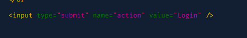
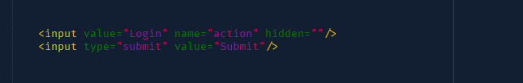

# Java module

All packages are in the dev folder.

Note:

- I deleted the key in the demo folder. If you need to run it, please register for a new key.

## 1.reCaptcha [Video Link](https://youtu.be/MMCyGZnHgvE)

- Google reCaptcha Link: https://www.google.com/recaptcha/admin

### Error:

- None action parameter

  Form this picture

  

  To this one

  

## 2.Payment

- This module is building with MoMo API.

## 3.Login Google [Video Link](https://youtu.be/bCkGaym6SSQ)

- Register Google Key: https://console.cloud.google.com/apis/dashboard

Note:

- to get a full profile of user, please change to scope to "scope=email%20profile%20openid"

## 4.Log4j

- This module is building

## 5.Email [Video Link](https://youtu.be/4YDLckENeRQ)

- Sendgrid: https://app.sendgrid.com

- Sendgrid Jar file: [Click Here to Download](./dev/send-email/sendgrid-java.jar)

Note:

- You must have a domain and Sendgrid account to send email, you can contact me for help.

## 6.Verify email [Video Link](https://youtu.be/1Enj2qEZbxw)

Note:

- You must deploy your project to a live website to verify email, you can contact me for help.

# Please give me a star if this project helps your assignment

# Contact Me: https://www.facebook.com/Heaty566
